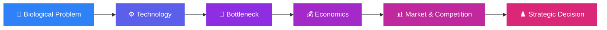
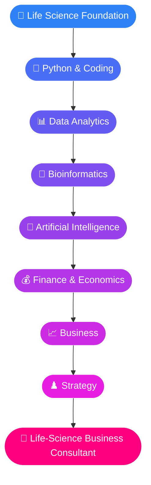
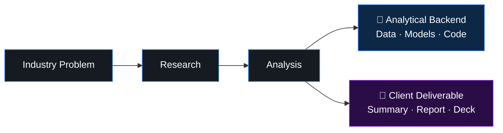

<div align="center">


<br/>

<a href="https://github.com/sunilnarayan419-ui"></a>


</div>

<br/>

## ⚡ Who is this guy?

```yaml
name: Sunil Mandloi
role: Life Science Student → Future Biotech Business Consultant
studying_at: University of Hyderabad (I.MSc. Life Science)
obsession: "Where does a biology problem turn into a business decision?"
mode: Learn → Build → Break → Debug → Analyze → Document → Repeat
```

<div align="center">

</div>

<br/>

> I'm not collecting skills to collect them. I'm stacking **Biology + Code + Data + Finance + Strategy** into one lens — so I can look at a scientific problem and see the business decision hiding inside it.

---

## 🧬 The Signal I'm Chasing

<div align="center">



</div>

---

## 🎮 Character Build

<table width="100%">
<tr>
<td width="50%" valign="top">

**🧬 Biology**
`████████████████░░░░` 80%

**🐍 Python & Code**
`████████████░░░░░░░░` 60%

**📊 Data Analysis**
`███████████░░░░░░░░░` 55%

</td>
<td width="50%" valign="top">

**💰 Finance & Economics**
`██████████░░░░░░░░░░` 50%

**♟️ Strategy & Consulting**
`█████████░░░░░░░░░░░` 45%

**🤖 AI for Life Sciences**
`████████░░░░░░░░░░░░` 40%

</td>
</tr>
</table>

<sub>⚠️ Self-rated skill bars — not a certification, just where the grind currently stands.</sub>

---

## 🗺️ The Long Game

<div align="center">



</div>

---

## 🕹️ Quest Log — Active Projects

<table width="100%">
<tr><th align="left">Project</th><th align="left">What it does</th><th align="left">Status</th></tr>
<tr>
<td>📚 <b>Library Management System</b></td>
<td>Python app for books, users, issuing & returns</td>
<td>🟢 Active</td>
</tr>
<tr>
<td>📊 <b>Sales Performance Tracker</b></td>
<td>Tracks sales activity, targets & team insights</td>
<td>🟢 Active</td>
</tr>
<tr>
<td>💰 <b>Startup Runway Manager</b></td>
<td>Cash burn, runway & early-stage financial decisions</td>
<td>🟢 Active</td>
</tr>
<tr>
<td>🧬 <b>Mini Bio-Python Projects</b></td>
<td>Python meets molecular biology & protein analysis</td>
<td>🟡 Growing</td>
</tr>
<tr>
<td>💻 <b>Python Practice Vault</b></td>
<td>Fundamentals, logic & problem-solving reps</td>
<td>🔄 Ongoing</td>
</tr>
</table>

---

## 🏗️ How I Build Things

<div align="center">



</div>

Every real project I ship carries **both halves** — the code/model that proves I can do the work, and the report/memo that proves I can communicate it to someone who makes decisions.

---

## 💼 The Lens I Analyze Businesses Through

<table width="100%">
<tr><td width="20%" align="center">🎯<br/><b>Market</b></td><td>Who's the customer, how big is the market, what drives demand?</td></tr>
<tr><td align="center">⚙️<br/><b>Technology</b></td><td>What creates the edge, how mature is it, where does it break?</td></tr>
<tr><td align="center">💰<br/><b>Economics</b></td><td>What's the cost, where's the value, what drives the margin?</td></tr>
<tr><td align="center">🥊<br/><b>Competition</b></td><td>Who's fighting for the same space, how hard is entry?</td></tr>
<tr><td align="center">♟️<br/><b>Strategy</b></td><td>Build, buy, partner, or license — and what should happen next?</td></tr>
</table>

---

## 📊 GitHub Pulse

<div align="center">


<br/>

</div>

<sub>⚠️ These cards pull live data from GitHub — the numbers grow as the commits do.</sub>

---

<div align="center">

## 🧭 The Principle Behind All of This

<h3>
🧬 Science explains what is <i>possible</i>.<br/>
📊 Data shows what is <i>happening</i>.<br/>
💰 Economics tells us what is <i>valuable</i>.<br/>
♟️ Strategy decides what we <i>should do</i>.
</h3>

</div>

---

## 🤝 Let's Build / Talk / Argue About Biotech Strategy

If you care about biotechnology, life sciences, bioinformatics, AI, healthcare, pharma, finance, strategy, or scientific entrepreneurship — my inbox (aka my GitHub) is open.

<div align="center">
<a href="https://github.com/sunilnarayan419-ui"></a>
</div>


</div>
